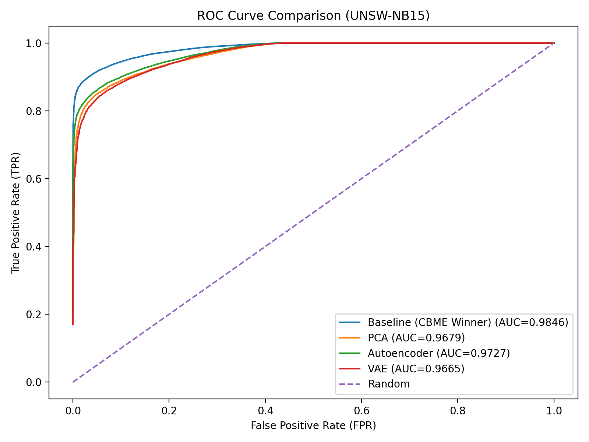
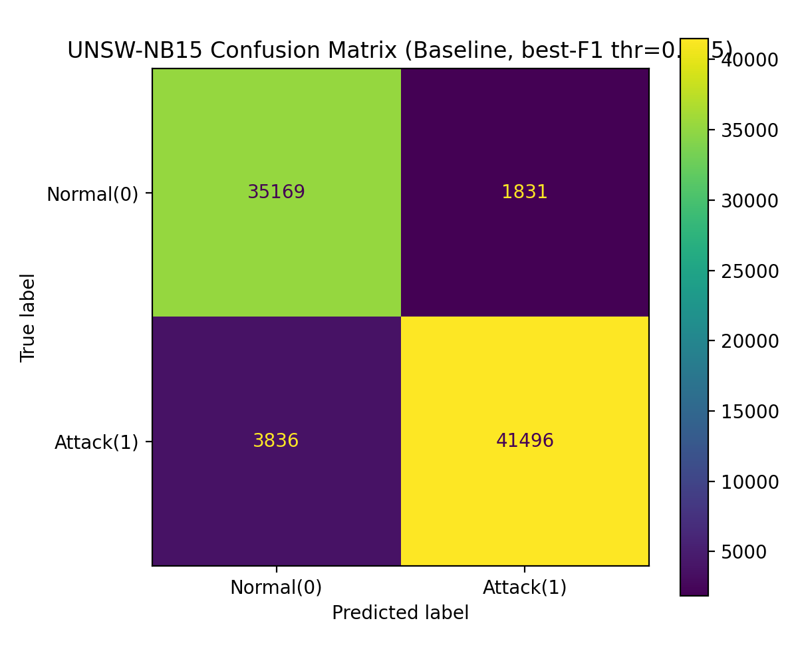

# AutoML-Based Anomaly Detection for Cybersecurity

## Overview
This project presents a fully automated machine learning pipeline for detecting anomalies in network traffic using the UNSW-NB15 dataset, with validation on NSL-KDD.

## Key Contributions
- Fully automated pipeline (no manual feature selection)
- Mutual Information + CBME feature optimisation
- Representation learning (PCA, Autoencoder, VAE)
- H2O AutoML model selection
- Cross-dataset validation
- SHAP explainability

## Results
- AUC: 0.9846
- F1-score: 0.9365
- FPR: 0.0494

## Notebooks
- `01_AutoML_Pipeline.ipynb` – End-to-end pipeline
- `02_results_and_evaluation.ipynb` – Metrics and performance
- `03_model_deployment.ipynb` – Model saving and inference
- `04_system_demonstration.ipynb` – Workflow demonstration
- `05_reproducibility_check.ipynb` – Reproducibility validation
- `06_final_results_analysis.ipynb` – Final comparisons and insights

## Technologies
- Python
- Jupyter Notebook
- H2O AutoML
- Scikit-learn
- SHAP

## Example Results

## Note
Datasets are not included due to size and licensing.
