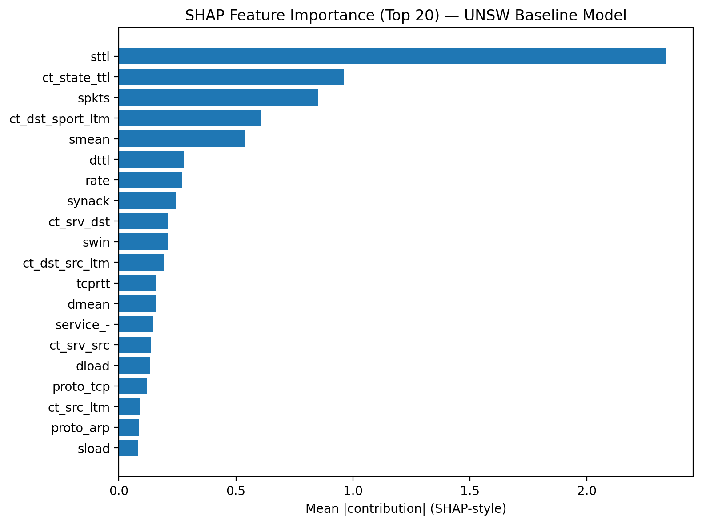

# AutoML-Based Anomaly Detection for Cybersecurity

## Overview
This project presents a fully automated machine learning pipeline for detecting anomalies in network traffic using the UNSW-NB15 dataset, with validation on NSL-KDD. The system eliminates manual feature selection and leverages AutoML to optimise model performance.

## Key Contributions
- Fully automated pipeline (zero manual feature selection)
- Mutual Information + CBME feature optimisation
- Representation learning (PCA, Autoencoder, VAE)
- H2O AutoML for model selection and optimisation
- Cross-dataset validation (UNSW-NB15 → NSL-KDD)
- SHAP-based model explainability

## Results
| Metric | Score |
|--------|------|
| AUC | 0.9846 |
| F1-score | 0.9365 |
| FPR | 0.0494 |

## Notebooks
- `01_AutoML_Pipeline.ipynb` – End-to-end pipeline
- `02_results_and_evaluation.ipynb` – Performance metrics and evaluation
- `03_model_deployment.ipynb` – Model saving and inference
- `04_system_demonstration.ipynb` – Pipeline workflow demonstration
- `05_reproducibility_check.ipynb` – Reproducibility validation
- `06_final_results_analysis.ipynb` – Final comparison and insights

## Technologies
- Python
- Jupyter Notebook
- H2O AutoML
- Scikit-learn
- SHAP

## Skills Demonstrated
- Machine Learning & AutoML
- Feature Engineering & Selection
- Anomaly Detection
- Model Evaluation & Optimisation
- Explainable AI (SHAP)

## Example Results

## How to Run
1. Install dependencies (Python 3.x)
2. Open notebooks in Jupyter
3. Run `01_AutoML_Pipeline.ipynb` to execute the full pipeline

## Note
Datasets are not included due to size and licensing restrictions.
